<!-- heatmap con datos reales, regenerado a diario por .github/workflows/update-profile-art.yml -->

<h3><code>natalio@github ~ $ ./contributions.sh</code></h3>

 
 

<!-- retrato ASCII (izq.) + neofetch (der.): ambos SVG miden 840x880, mismo ancho = misma altura -->

<h3><code>natalio@github ~ $ whoami</code></h3>

<table>
<tr>
<td valign="top"></td>
<td valign="top"></td>
</tr>
</table>

 
 

<h3><code>natalio@github ~ $ ./links.sh</code></h3>

<b>Frontend, AI & Data Developer · Co-Founder en Fractal Agency</b>

 

<code>natalio@github ~ $ cat experiencia.md</code>

 

### 🏦 NTT Data (Cliente: BBVA) | *Desarrollador (Big Data e IA)*
*Actualmente*
- Desarrollo de soluciones en el departamento de Big Data e Inteligencia Artificial.
- Manejo avanzado de datos, automatizaciones de procesos y desarrollo de interfaces Frontend.

### 🌊 SALTWAVE - Empresa de Servicios Marítimos (Malta) | *Web Developer & Digital Manager*
*Desarrollo Internacional*
- Desarrollo completo de la web corporativa desde cero, estructurando secciones informativas y de servicios.
- Gestión de redes sociales y creación de contenido orgánico alineado con la identidad de la marca.
- Trabajo en un entorno internacional 100% en inglés, adaptando la comunicación a un público diverso.

### 🛒 Movil Europa - Tech Company | *Full Stack E-commerce Developer*
*Inicios profesionales*
- Desarrollo de tienda online desde cero, orientada a la conversión y UX/UI.
- Integración de sistemas complejos: pasarelas de pago, logística (almacén y repartos en 24-48h).
- Implementación de ecosistema de marketing: Email marketing, Facebook Ads, Google Ads y sincronización de catálogos en RRSS, logrando un aumento directo en ventas y fidelización.

 

<i>"El código es mi herramienta; aportar valor real, mi objetivo."</i>

